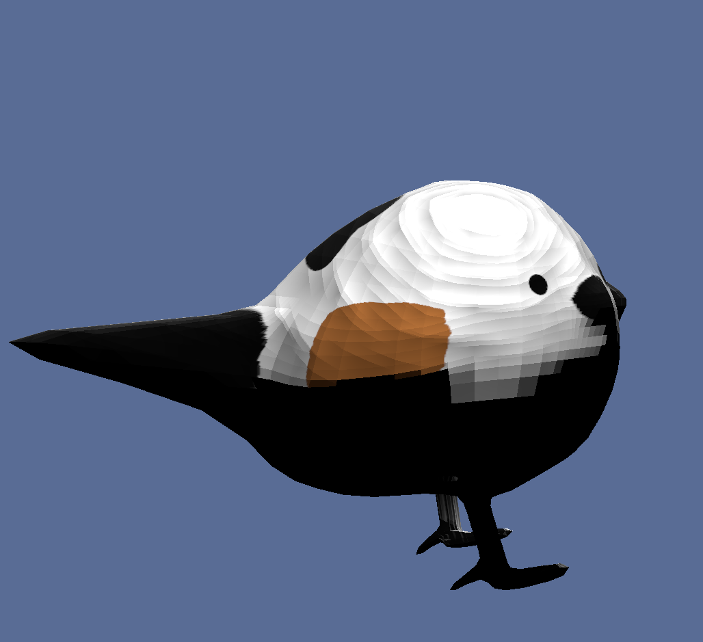

# rend3使ってgltfモデルの位置を調整しようとしたら

## この度の構成

* 背景
* 起こった不具合
* ごり押しで解決

## 背景

rend3はrustの3Dレンダリングライブラリの一つで，wgpuをより使いやすくしたものらしい．

rend3の拡張パッケージとしてrend3-gltfというものがあるが，これを使うとgltfの表示とアニメーションの再生もできるらしい．公式リポジトリにexampleあるので参考に．
https://github.com/BVE-Reborn/rend3

## 起こった不具合

以下のコードでgltfの読み込みとサイズの調整を行ったところ...

```
let path = Path::new("assets/bird_rn.glb");
let gltf_data = std::fs::read(path).unwrap();
let parent_directory = path.parent().unwrap();
let (_loaded_scene, mut loaded_instance) = pollster::block_on(rend3_gltf::load_gltf(
    &renderer,
    &gltf_data,
    &rend3_gltf::GltfLoadSettings::default(),
    |p| async move { rend3_gltf::filesystem_io_func(&parent_directory, &p).await },
))
.expect("Loading gltf scene");

//ここの処理を挟んで悲劇が訪れる
for node in loaded_instance.nodes.iter_mut(){
    for prim in node.inner.object.as_mut().unwrap().inner.primitives.iter(){
        renderer.set_object_transform(prim, glam::Mat4::from_scale(glam::vec3(1.0,1.0,1.0)));
    }
}

```

### 理想


モデル自体は回転させず，モデルの周りをWASDとマウス操作で移動するのでこうなるはず．

### 現実（gif添付）


まったく同じ操作してんのにどういうことや....
モデルが勝手に回転してる？いや回転の処理なんて書いてないぞ？

観察すること約2日経過...

こ，これは!!



何かしらの原因でメッシュの法線が逆方向になって外側メッシュが非表示に！(...え？いや，なんで？)  
内側メッシュしか見えないので，それで回転してる風に見えるらしい！

## ごり押しで解決

考えるのをあきらめてblenderでメッシュの法線方向を真逆にした．
https://qiita.com/sanpeita/items/aba3c921f135177629fc

あとはライトの向きを逆にして同じようになる．

